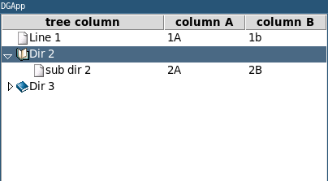

<center>

**[dbpp.widgets](dbpp.widgets.md) package:** 
[GuiBaseClass](dbpp.widgets.GuiBaseClass.md) -
[AutoScrollbar](dbpp.widgets.AutoScrollbar.md) -
[Balloon](dbpp.widgets.Balloon.md) -
[Ctext](dbpp.widgets.Ctext.md) -
[LabEntry](dbpp.widgets.LabEntry.md) -
[RoText](dbpp.widgets.RoText.md) -
[Scrolled](dbpp.widgets.Scrolled.md) -
[SqlText](dbpp.widgets.SqlText.md) -
[StatusBar](dbpp.widgets.StatusBar.md) -
[TableView](dbpp.widgets.TableView.md) -
[TextMixins](dbpp.widgets.TextMixins.md) -
[XTableView](dbpp.widgets.XTableView.md) -
[XTreeView](dbpp.widgets.XTreeView.md) 

**apps:** [dbpp.peditor](dbpp.peditor.PumlEditor.md)

**[dbpp.kroki](dbpp.kroki.md) package:** 
[dbpp.kroki.KrokiEncoder](dbpp.kroki.KrokiEncoder.md)

</center>

<!-- markdownlint-disable -->

<a href="../dbpp/widgets/XTreeView.py#L0"></a>

# <kbd>module</kbd> `widgets.XTreeView`
Tree widget based on ttk.Treeview with scrollbars shown if needed and default images. 

This a widget to tree like data using the standard ttk.Treeview widget,  inheriting all its methods and options. Further the widget has automatically shown or hidden scrollbars and as  well some default images which simplify creating nice tree widgets. To use the pack geometry manager you can just use the pack and the  pack_forget commands of this widget as these are forwarded to the frame.  For other geometry managers like grid, the panedwindow or the notenbook you should use the [getFrame](#getFrame) method. 


**Examples:**
 

```
import tkinter as tk
import tkinter.ttk as ttk
from dbpb.widgets.XTreeView import XTreeView
root = tk.Tk()
root.title('DGApp')
dgtree=XTreeView(root,sheetsym=False)
dgtree.configure(columns=("one","two"))
dgtree.column("one", width=100 )
dgtree.column("two", width=100)
dgtree.heading("#0", text="tree column")    
dgtree.heading("one", text="column A")
dgtree.heading("two", text="column B")
dgtree.insert("",0,text="Line 1",values=("1A","1b")),
id2 = dgtree.insert("",1,"dir2",text="Dir 2")
dgtree.insert(id2,"end","dir 2",
    text="sub dir 2", values=("2A","2B"))

dgtree.insert("", 3, "dir3", text="Dir 3")
dgtree.insert("dir3", 3,
    text=" sub dir 3",values=("3A"," 3B"))
def printSelection(event):
    item = dgtree.identify('item',event.x,event.y)
    print(item)
dgtree.bind("<Double-1>",printSelection)
dgtree.bookify()
root.mainloop()
``` 


 

**Author:** Detlef Groth, University of Potsdam, 2019-2023 

**License:** MIT - License 


---

<a href="../dbpp/widgets/XTreeView.py#L57"></a>

## <kbd>class</kbd> `XTreeView`
Extended ttk.Treeview widget. 

<a href="../dbpp/widgets/XTreeView.py#L59"></a>

### <kbd>method</kbd> `__init__`

```python
__init__(parent, sheetsym=False, *args, **kwargs)
```

The constructor to create a XTreeView widget.  


**Args:**
 
 - <b>`parent`</b> (ttk.Frame):  the parent widget wherein the ttk.Treeview widget will be placed. 
 - <b>`sheetsym`</b> (bool):  should table sheet symbols be shown, defaults to False 
 - <b>`*args (list)`</b>:  standard ttk.Treeview arguments which will be delegated to the widget 
 - <b>`**kwargs (dict)`</b>:  standard ttk.Treeview arguments which will be delegated to the widget 


---

<a href="../dbpp/widgets/XTreeView.py#L136"></a>

### <kbd>method</kbd> `bookify`

```python
bookify(item='')
```

Displays all images in the tree widget, starting from root or from the given item. 


**Args:**
 
 - <b>`item`</b> (ttk.Treeview item):  the parent item from where the images, should be initialized, defaults to the empty string, the root item. 

---

<a href="../dbpp/widgets/XTreeView.py#L156"></a>

### <kbd>method</kbd> `getFrame`

```python
getFrame()
```

Returns the frame in which the widget is embedded to perform, useful for packing or gridding the widget. 

This function is needed by geometry managers like grid or ttk.PanedWindow to manage the parent frame of the widget in the layout. For pack the default methods pack and pack_forget are defined. 

---

<a href="../dbpp/widgets/XTreeView.py#L177"></a>

### <kbd>method</kbd> `pack`

```python
pack(**kwargs)
```

Overwrites the default pack method to use the internal frame. 

---

<a href="../dbpp/widgets/XTreeView.py#L180"></a>

### <kbd>method</kbd> `pack_forget`

```python
pack_forget(**kwargs)
```

Overwrites the default pack_forget method to use the internal frame. 


---

_This file was automatically generated via [lazydocs](https://github.com/ml-tooling/lazydocs)._
